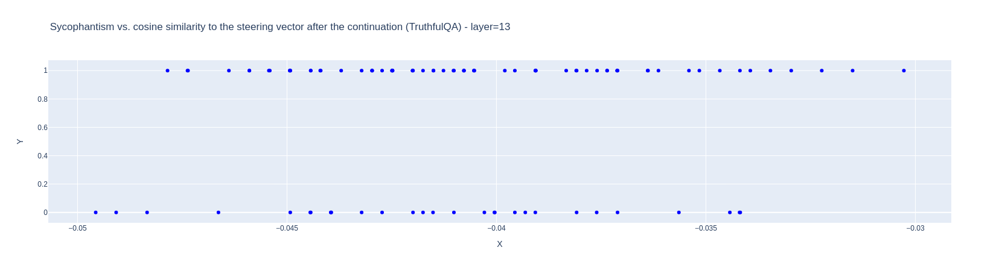
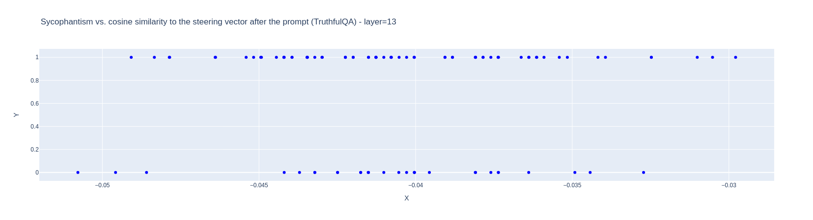
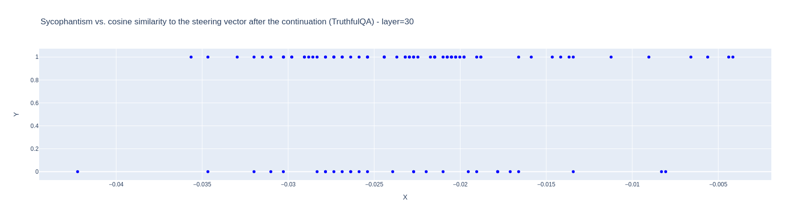
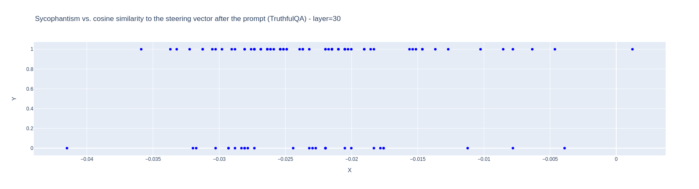
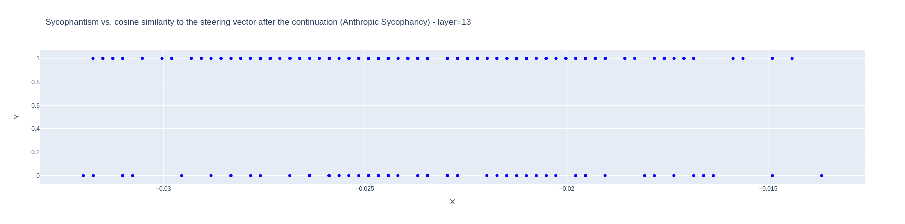
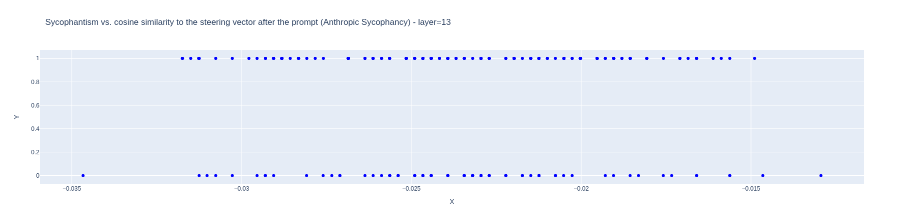
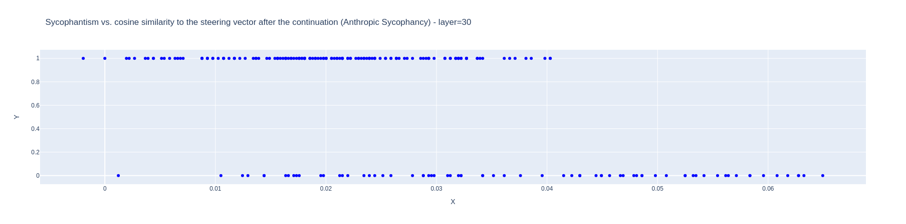
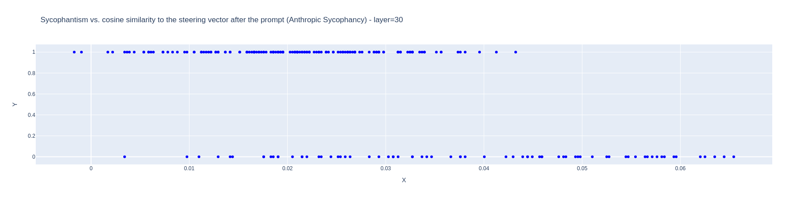

# Intro
The original post [Reducing sycophancy and improving honesty via activation steering](https://www.lesswrong.com/posts/zt6hRsDE84HeBKh7E/reducing-sycophancy-and-improving-honesty-via-activation#Reducing_sycophancy_via_activation_steering) identified vectors which could be used to induce or reduce sycophancy in LLaMA-7B by adding them to the model's activations during inference. The implication was that the vector 
This project attempts to use activation diffs to predict whether a model is going to produce an output with a given feature, as well as to retroactively predict whether a completed output has that feature.

The author finds that an activation vector derived by contrasting sycophantic and non-sycophantic activations on Anthropic's [sycophancy dataset](https://huggingface.co/datasets/Anthropic/model-written-evals/tree/main/sycophancy) can be used to influence whether the model reproduces common myths and misconceptions on [TruthfulQA](https://huggingface.co/datasets/truthful_qa) and concludes that there is a shared direction between sycophancy on questions of opinion and endorsing common false beliefs on questions of fact.

This project aims to investigate two questions:
1) can we use steering vectors to predict sycophancy rather than inducing it?
2) how much does predictivity vary depending on how we generate the steering vectors? [WIP]

The observation that a single activation steering vector can be used to modulate the model's dishonesty in the two contexts doesn't necessarily mean that it encodes anything to do with dishonesty, per se. It could encode some other thing that incidentally leads to dishonesty such as, say, attending heavily to previous word choice.

If steering vectors are robustly predictive, that suggests that, in practice, sycophancy tends to arise for the same reason in diverse situations (namely because its intermediate activations pointed towards that direction).
That would suggest that they represent something closer to an optimization target than a specific structural feature which happens to lead to sycophancy.

To that end, I:
a) generate steering vectors in multiple ways and explore how they vary in subjective effect on model outputs and cosine similarity
b) measure how much the cosine similarity between the model's actual activations and the steering vectors correlates with the sycophantism of the output
(except (a) is largely a work in progress).

This project is very unfinished as of 11/17/23 because I wanted to publish this codebase so I could link in on my MATS application.
In particular, all experiments are performed on Zephyr-7B beta at very small scale and I really want to acquire more diverse datasets and reproduce some of the original author's later experiments.

Note that, unlike, the original paper, I do my experiments on Zephyr-7b-beta, which is heavily fine-tuned for chat and honesty.

# Predictivity of steering vectors
Premise: if we have successfully identified a vector that encodes something like "respond sycophantically", we might expect that, in situations were the model is spontaneously behaving sycophantically, its activations would have high cosine similarity with that vector. Whereas if it encodes some other target which leads to sycophancy there is less reason to expect unrelated sycophancy to have the same cause.

I extract steering vectors for sycophancy from activations on Anthropic's [sycophancy dataset](https://huggingface.co/datasets/Anthropic/model-written-evals/tree/main/sycophancy) in the same fashion as the original paper.

Then, for each prompt in a different subset, I generate model continuations and record whether the continuation was sycophantic, the model's intermediate activations after being given the prompt, and the model's intermediate activations after generating its continuation.

Then I test whether the cosine similarity between either of those activations and my steering vectors is predictive of sycophancy on other examples.

I also tried this with a subset of TruthfulQA with answers which I graded by hand. 

For both post-prompt and post-continuation activations: the steering vector was highly predictive of sycophancy in distribution (the examples are also from the sycophancy dataset) and not at all predictive out of distribution (on TruthfulQA). However, this comes with the important caveat that my out of distribution test was pretty bad.

Additionally, the steering vector was not at all predictive on layer 13 on either dataset, and was most predictive on layer 30 (among layers [13, 30]).

## TruthfulQA Cosine Similarity

## Anthropic Sycophancy Cosine Similarity

