# Intro
This project is a follow-up to the post [Reducing sycophancy and improving honesty via activation steering](https://www.lesswrong.com/posts/zt6hRsDE84HeBKh7E/reducing-sycophancy-and-improving-honesty-via-activation#Reducing_sycophancy_via_activation_steering). The original post identified vectors which could be used to induce or reduce sycophancy in LLaMA-7B by adding them to the model's activations during inference and argued that those vectors might useful for generally understanding deceptive behavior in large language models.

The author found that an activation vector derived by contrasting sycophantic and non-sycophantic activations on Anthropic's [sycophancy dataset](https://huggingface.co/datasets/Anthropic/model-written-evals/tree/main/sycophancy) can be used to influence whether the model reproduces common myths and misconceptions on [TruthfulQA](https://huggingface.co/datasets/truthful_qa) and concluded that there is a shared direction between sycophancy on questions of opinion and endorsing common false beliefs on questions of fact.

This project aims to investigate two questions:
1) can we use steering vectors to predict sycophancy rather than inducing it?
2) how much does predictivity vary depending on how we generate the steering vectors? [WIP]

The observation that a single activation steering vector can be used to modulate the model's dishonesty in the two contexts doesn't necessarily mean that it encodes anything to do with dishonesty, per se. It could encode some other thing that incidentally leads to dishonesty such as, say, attending heavily to previous word choice.

However, if steering vectors are robustly predictive, that suggests that sycophancy tends to arise for the same reason in diverse situations (namely because the models intermediate activations encode the target of sycophantic outputs).

That would suggest that they represent something closer to a general optimization target than a specific structural feature which happens to lead to sycophancy.

To that end, I:
1) generate steering vectors in multiple ways and explore how they vary in usefulness for steering the model and for prediciting model behavior
2) measure how much the cosine similarity between the model's actual activations and the steering vectors correlates with the sycophantism of the output

(except (1) is largely a work in progress).

This project is very unfinished as of 11/17/23 because I wanted to publish this codebase so I could link to it on my MATS application.

In particular, all experiments are performed on LLaMa or Zephyr-7B-beta at very small scale and I really want to acquire more diverse datasets and reproduce some of the original author's later experiments. Additionally, I don't yet answer the questions which originally drove this project: how much do extracted steering vectors vary depending on the set of prompts they were extracted from? And what features of the extraction process influence the predictivity of the resulting vectors?

# Predictivity of steering vectors
Premise: if we have successfully identified a vector that encodes something like "respond sycophantically", we might expect that, in situations where the model is spontaneously behaving sycophantically, its activations would have high cosine similarity with that vector. Whereas if it encodes some other target which leads to sycophancy there is less reason to expect unrelated sycophancy to have the same cause.

To investigate predictivity, I start by extracting steering vectors for sycophancy from activations on Anthropic's [sycophancy dataset](https://huggingface.co/datasets/Anthropic/model-written-evals/tree/main/sycophancy) in the same fashion as the original paper.

Then, for each prompt in a different subset, I generate model continuations and record whether the continuation was sycophantic, the model's intermediate activations after being given the prompt, and the model's intermediate activations after generating its continuation.

Finally, I test whether the cosine similarity between either of those activations and my steering vectors is predictive of sycophancy on other examples.

I also repeat the experiment by predicting accuracy on a subset of TruthfulQA. I graded the generations for accuracy by hand.

For both post-prompt and post-continuation activations, I find that the steering vector is predictive of sycophancy in distribution (when the examples are also from the sycophancy dataset) and not predictive out of distribution (on TruthfulQA). However, this comes with the important caveat that my out of distribution test was pretty bad.

Confusingly, sycophancy correlates positively with cosine similarity at layer 13 and then smoothly decreases up to layer 30 where it is significantly negative.

The graphs below plot whether the model generated a sycophantic response against the cosine similarity between my steering vector and the model's intermediate activations in several contexts.

## TruthfulQA Cosine Similarity
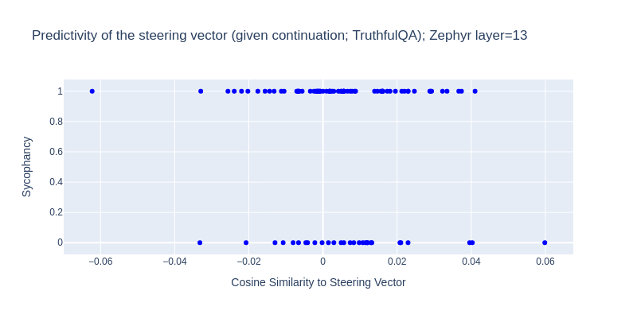
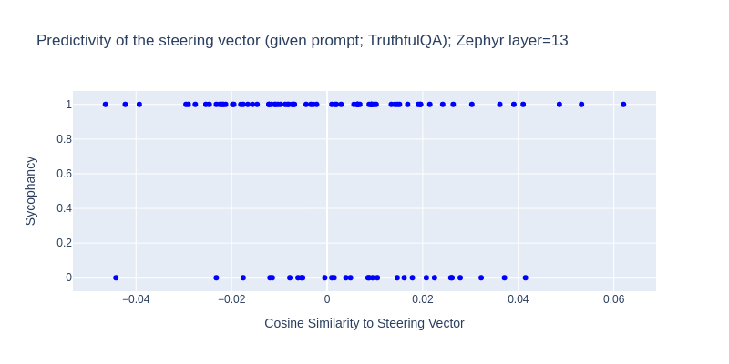

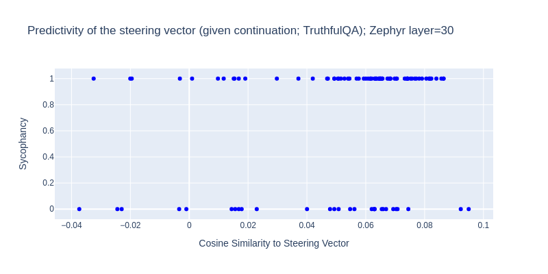
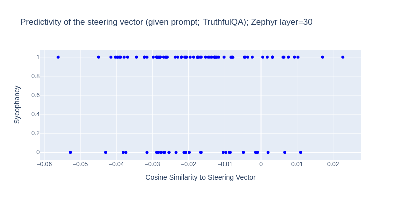

## Anthropic Sycophancy Cosine Similarity
### Zephyr
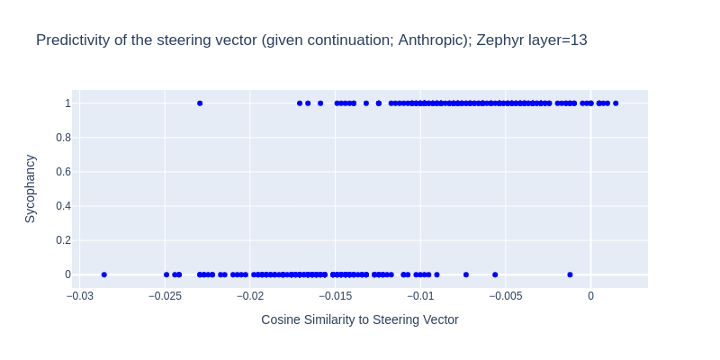
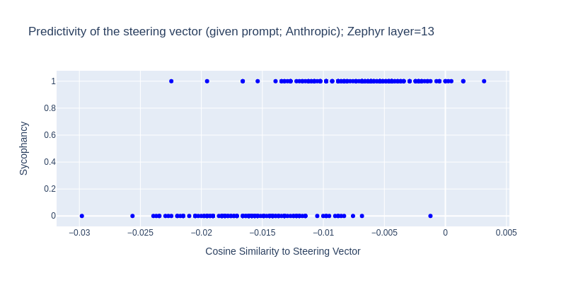

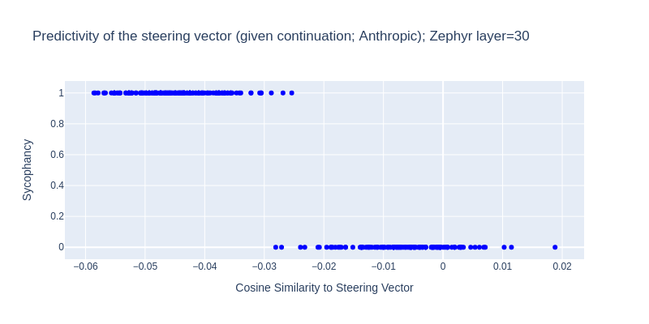
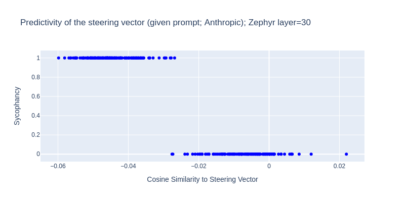

### LLaMA
*Note*: these graphs use the steering vector derived from LLaMA-7B to predict the sycophancy of Zhepyr-7B. This is because LLaMA-7B is not instruction tuned and didn't obey the target output format and I have not implemented a system for labeling LLaMA-7B outputs as sycophantic or not.

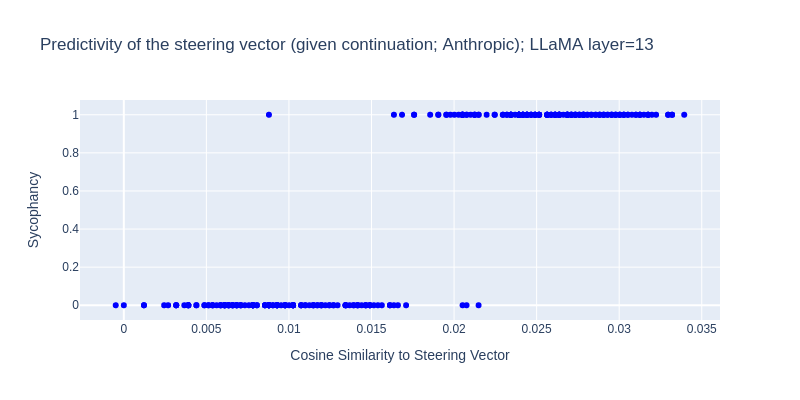
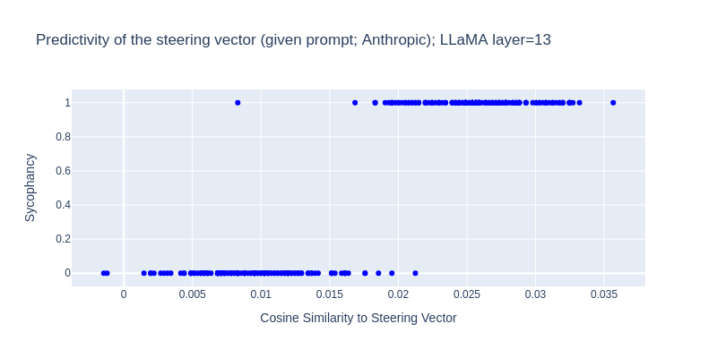

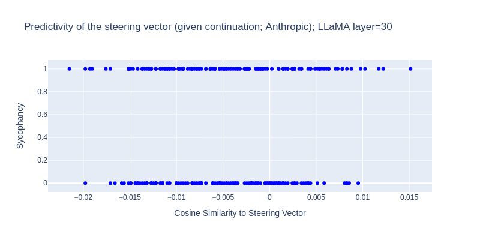
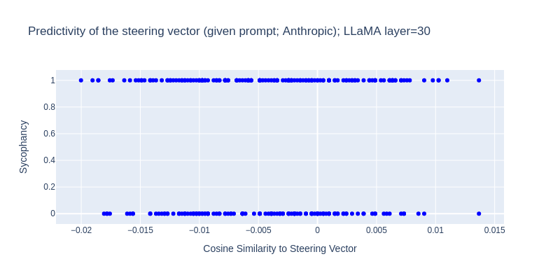

# Conclusions
Steering vectors derived from both LLaMA-7B and from Zephyr-7B can be used to predict both whether Zephyr-7B is going to be sycophantic and whether a generated response was sycophantic *if* both the steering vectors and the tests use prompts drawn from Anthropic's [sycophancy dataset](https://huggingface.co/datasets/Anthropic/model-written-evals/tree/main/sycophancy).

This is mildly suggestive that they could be predictive in general but leaves much work to be done.

# Next steps
The original conceit of this project was to investigate whether fine-tuning a highly steerable model like Zephyr for sycophancy would lead it to do something like activation steering on itself; specifically, can we extract steering vectors by comparing the intermediate activations of sycophantic!zephyr with those of unsycophantic!zephyr on a fixed prompt?

This would provide hints about how foundation models learn new skills and, if answered posivitely, would cause me to update towards believing that large language models can meaningfully be said to have simple encodings for high level targets like "behave sycophantically".

My immediate plan is to:
1) implement numeric measures of predictivity rather than looking at graphs and observing that some graphs have an obvious trendline and some do not.
2) build some simple tools for measuring consistency between two steering vectors
3) investigate whether sycophancy can be modulated by removing the component of the models intermediate activation which is parallel to my steering vector
4) repeat my experiments with steering vectors derived by fine-tuning Zephyr and from other, differently structured datasets